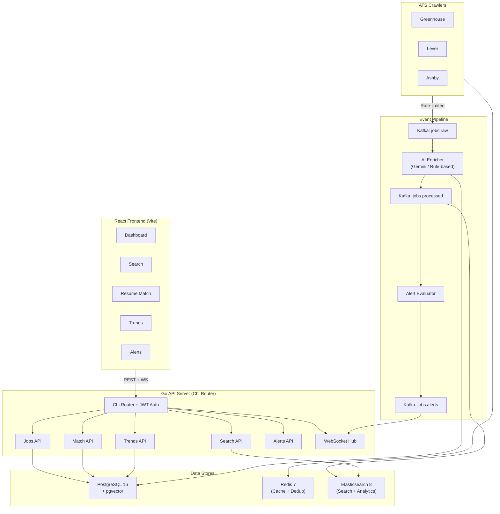

# JobCrawl — AI-Powered Job Intelligence Platform

> Crawl job postings from major ATS platforms, extract structured data with AI, and search/match/trend-analyze them through a premium React dashboard.


---

## Architecture



---

## Features

- ✅ **Multi-ATS Crawling** — Greenhouse, Lever, Ashby with per-domain rate limiting and circuit breakers
- ✅ **AI-Powered Enrichment** — Skill extraction, seniority detection, salary parsing, and job summarization (Gemini / rule-based fallback)
- ✅ **Full-Text Search** — Elasticsearch-backed search with faceted filtering (skills, seniority, location, company)
- ✅ **Resume Matching** — Paste your resume, get scored job matches with skill-level breakdown
- ✅ **Trend Analytics** — Skill demand over time, company hiring activity, salary range charts
- ✅ **Real-Time Alerts** — Define alert rules, get WebSocket notifications when matching jobs appear
- ✅ **Event-Driven Pipeline** — Kafka (KRaft) for decoupled crawl → enrich → index → alert flow
- ✅ **JWT Authentication** — User registration, login, profile management
- ✅ **Premium Dashboard** — Dark theme React UI with glassmorphism, Recharts, micro-animations
- ✅ **Single Binary Deploy** — Go embeds the React build for one-command production deployment
- ✅ **Graceful Degradation** — Kafka, Elasticsearch, and Redis are all optional; core flow works without them

---

## Tech Stack

| Layer | Technology | Purpose |
|-------|-----------|---------|
| **Backend** | Go 1.26, Chi v5 | API server, crawlers, pipeline orchestration |
| **Frontend** | React 19, Vite, Recharts | Dashboard with code-split lazy-loaded routes |
| **Database** | PostgreSQL 16 + pgvector | Primary store, embeddings, full-text fallback |
| **Cache** | Redis 7 | Crawl dedup, rate limiting, API caching |
| **Search** | Elasticsearch 8 | Full-text search, faceted filtering, aggregations |
| **Events** | Kafka (KRaft) | Async processing pipeline, alert fan-out |
| **AI** | Google Gemini Flash | Skill extraction, job summarization |
| **Auth** | JWT + bcrypt | Stateless authentication |

---

## Quick Start

### Prerequisites

- **Go 1.26+**
- **Node.js 20+** and npm
- **Docker Desktop** (for PostgreSQL, Redis, Elasticsearch, Kafka)

### 1. Clone and install dependencies

```bash
git clone https://github.com/AtharvGupta360/JobCrawl.git
cd JobCrawl

# Go dependencies
go mod download

# Frontend dependencies
make web-install
```

### 2. Start infrastructure

```bash
make infra          # Starts PostgreSQL, Redis, Elasticsearch, Kafka
make kafka-topics   # Creates required Kafka topics
```

### 3. Configure environment

```bash
cp .env.example .env
# Edit .env with your API keys (GEMINI_API_KEY for AI features)
```

### 4. Seed demo data

```bash
make seed   # Populates ~150 jobs, skills taxonomy, trend snapshots, demo user
```

### 5. Run

```bash
# Option A: Development (separate frontend + backend)
make dev        # Terminal 1: Go backend on :8080
make web-dev    # Terminal 2: Vite dev server on :5173

# Option B: Production (single binary)
make prod-run   # Builds frontend + Go binary, serves everything on :8080
```

### 6. Login

Open `http://localhost:5173` (dev) or `http://localhost:8080` (prod).

**Demo account:** `demo@jobcrawl.dev` / `demo1234`

---

## API Overview

| Method | Endpoint | Auth | Description |
|--------|----------|------|-------------|
| `GET` | `/health` | — | Health check (PG, Redis, ES) |
| `POST` | `/api/v1/auth/register` | — | Create account |
| `POST` | `/api/v1/auth/login` | — | Login, get JWT |
| `GET` | `/api/v1/auth/me` | JWT | Get current user |
| `PUT` | `/api/v1/auth/me` | JWT | Update profile |
| `GET` | `/api/v1/jobs` | — | List jobs (paginated, filterable) |
| `GET` | `/api/v1/jobs/:id` | — | Job details |
| `GET` | `/api/v1/jobs/stats` | — | Aggregate statistics |
| `GET` | `/api/v1/search` | — | Full-text search (ES) |
| `GET` | `/api/v1/companies` | — | List companies |
| `POST` | `/api/v1/companies` | — | Add company |
| `POST` | `/api/v1/crawl/trigger` | — | Trigger crawl (all) |
| `POST` | `/api/v1/crawl/trigger/:slug` | — | Trigger crawl (one) |
| `GET` | `/api/v1/crawl/runs` | — | Crawl history |
| `GET` | `/api/v1/crawl/health` | — | Crawler health |
| `GET` | `/api/v1/alerts` | JWT | List alerts |
| `POST` | `/api/v1/alerts` | JWT | Create alert |
| `DELETE`| `/api/v1/alerts/:id` | JWT | Delete alert |
| `GET` | `/api/v1/notifications` | JWT | Notification inbox |
| `POST` | `/api/v1/match/resume` | JWT | Match resume to jobs |
| `GET` | `/api/v1/trends/skills` | — | Skill demand trends |
| `GET` | `/api/v1/trends/companies` | — | Company hiring trends |
| `GET` | `/api/v1/trends/salaries` | — | Salary range trends |
| `WS` | `/api/v1/ws/alerts` | JWT | Real-time notifications |

---

## Project Structure

```
cmd/
  server/main.go              Entry point — wires all dependencies
  seed/main.go                Demo data seeder
internal/
  api/
    router.go                 Chi router, Server struct
    handlers.go               Job, company, crawl handlers
    auth_handlers.go          Register, login, profile
    alert_handlers.go         Alert CRUD, notifications
    match_handlers.go         Resume matching
    trends_handlers.go        Trend analytics
    admin_handlers.go         Admin endpoints
    middleware.go             Logging, rate limiting, JWT, CORS
    static.go                 Embedded frontend serving (SPA)
  auth/
    jwt.go                    JWT generation and validation
    password.go               bcrypt password hashing
  config/
    config.go                 Env-based configuration
  crawler/
    crawler.go                Crawler interface
    greenhouse.go             Greenhouse ATS crawler
    lever.go                  Lever ATS crawler
    ashby.go                  Ashby ATS crawler
    scheduler.go              Cron-based crawl scheduling
    ratelimiter.go            Per-domain rate limiter + circuit breaker
    seed.go                   Default companies
  enricher/                   AI + rule-based job enrichment
  kafka/                      Event pipeline (Kafka consumers/producers)
  matcher/                    Resume-job scoring
  analytics/                  Trend snapshot generation
  models/                     Domain models (Job, Company, User, Alert, etc.)
  store/
    postgres.go               PostgreSQL + embedded migrations
    jobs.go                   Job/Company CRUD
    redis.go                  Cache, dedup, rate limiting
    elasticsearch.go          ES search + indexing
  ws/                         WebSocket hub for real-time alerts
web/                          React 19 + Vite frontend
  src/
    api/client.js             Fetch wrapper with JWT auth
    hooks/                    useAuth, useApi, useWebSocket, useToast
    components/               Layout, JobCard, Pagination, FilterBar, TagsInput
    pages/                    10 pages (Dashboard, Jobs, Search, Trends, Match, Alerts, etc.)
docker-compose.yml            PostgreSQL, Redis, ES, Kafka (KRaft), Kafka UI
Makefile                      dev, build, prod, seed, infra targets
```

---

## Development

### Available Make Targets

```bash
make help           # Show all targets
make dev            # Run Go backend (dev mode)
make web-dev        # Run Vite frontend (dev mode)
make build          # Build Go binary
make web-build      # Build frontend for production
make prod           # Build frontend + Go binary
make prod-run       # Build and run production binary
make seed           # Seed demo data
make infra          # Start Docker infrastructure
make infra-down     # Stop Docker infrastructure
make infra-reset    # Reset infrastructure (deletes data)
make kafka-topics   # Create Kafka topics
make test           # Run Go tests
```

### Environment Variables

See [`.env.example`](.env.example) for all configuration options. Key variables:

| Variable | Default | Description |
|----------|---------|-------------|
| `DATABASE_URL` | `postgres://...localhost:5432/jobcrawl` | PostgreSQL connection |
| `REDIS_URL` | `redis://localhost:6379` | Redis connection |
| `ELASTICSEARCH_URL` | `http://localhost:9200` | Elasticsearch URL |
| `KAFKA_BROKERS` | `localhost:9094` | Kafka broker addresses |
| `GEMINI_API_KEY` | — | Google Gemini API key (for AI enrichment) |
| `JWT_SECRET` | `dev-secret-...` | JWT signing secret |
| `APP_PORT` | `8080` | HTTP server port |

---

## License

MIT
